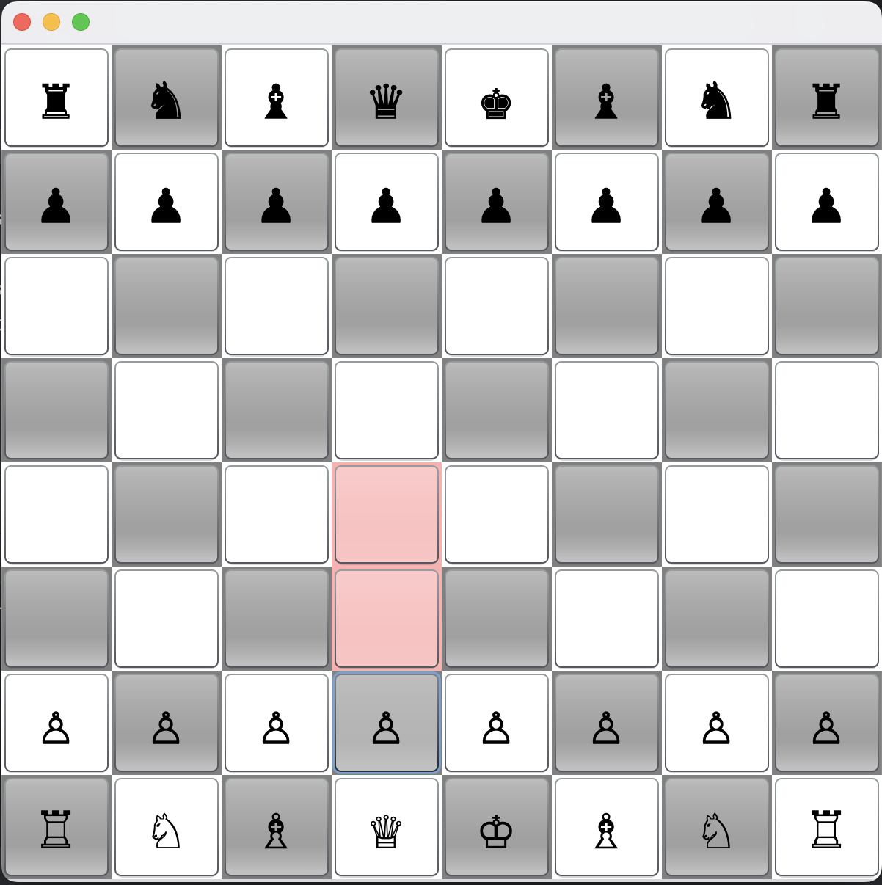

## Athena_Chess

It's a small chess game with an even smaller AI opponent programmed in a day. 

     
    <em>
    Figure 3: The system after the initialization (left) and the system after the simulation (right).
    </em>

### Basic information about the chess logic
The chess game can do all moves except: 
1. Castling
2. en passant
3. pawn promotion to something other than a queen 

### Basic information about the AI. 
The AI calculates four parameters to decide which move to take: 

1. How many moves can it make after taking a possible move? 
2. How many moves can the opponent make after taking a possible move?
3. How many (weighted) pieces the opponent has lost. 
4. Points from the recursion. 

A linear combination of those four parameters is calculated to evaluate how good one move is. 
The weights used for the linear combination are determined using a small training process. 

#### Recursion 
Each recursive step plays one move from the opponent and one for oneself. 
Both are chosen by an AI without recursion. 
Since the computational cost was too high, the AI for the recursion needed to be reduced to include only the "piece value" (point 3).
After that, the move value is evaluated and returned. Each recursion returns the value divided by 2 to get some smoothing. 

#### Training 
The training is very simple. First, two AIs get initialized: 

1. best_AI
2. new_AI

Imagine there would only be one parameter x. best_AI will be initialized with x=1. 
new_AI with x = best_AI.x+1. They play a defined number of times against each other. 
If new_AI wins, it will be the new best_AI, and the process will start over. If not, best_AI will stay best_AI. 

Comment: It is a bit more complicated, but not by much.
